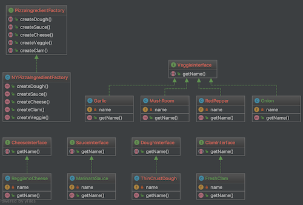
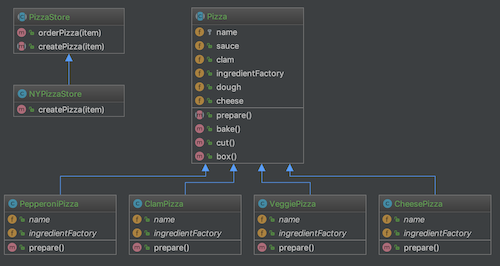

# AbstractFactory

具象クラスを指定することなく、  
一連の関連オブジェクトや依存オブジェクトを作成するための  
インターフェースを提供する。  

## IngredientFactory/  [Factory]  
- PizzaIngredientFactory（**主役**）  
ピザの食材を作成する具体的な方法は全く知りませんが、  
createCheeseメソッドを使えば、
CheeseInterfaceを実装したクラスを作れることを知っています。   

- NYPizzaIngredientFactory(PizzaIngredientFactoryの実装クラス)  
createCheeseメソッドを具体的に実装し、
メソッド内で具象食材(チーズ、生地、ソースなど)オブジェクトを作成します。  

## Ingredient/  [Product]  
- CheeseInterface  
抽象な食材(チーズ)のインターフェース

- ReggianoCheese(CheeseInterfaceの実装クラス)    
具象な食材(レジャーノチーズ)クラス

  

## PizzaStore/ [Client]  
AbstractFactoryのクライアント。  
`$nystore->orderPizza('チーズ')`  
とするだけで、pizzaクラスを介して  
ピザ工場に生地、ソース、チーズといった食材(製品)を作成してもらい、
それを調理し、チーズピザが帰ってくる。  

## Pizza/ [Client]  
ピザ工場に食材の作成を頼んでいる。

