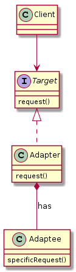
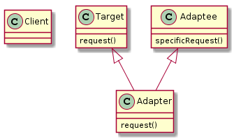
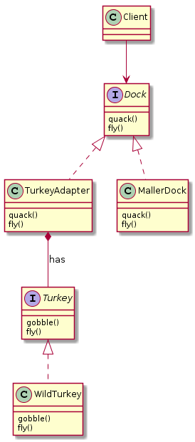

# Adapter

## Adapterパターン
クラスのインターフェースをクライアントが  
期待する別のインターフェースに変換する。  
アダプタは、互換性がないインターフェースのためにそのままでは連携できないクラスを連携させる。  
クライアントとアダプティが分離され、お互いはお互いをしらずにすむ。  
  
2パターンがある  
- オブジェクトアダプタ
- クラスアダプタ  
  
    
### オブジェクトアダプタ
オブジェクトコンポジションを使う。  
Adapteeの任意のサブクラスにもAdapterを使用できる。   
  

1. ClientはTargetInterfaceを使って、  
Adapterのメソッドを呼び出してリクエストを行う。  

2. AdapteeInterfaceを使って、  
AdapterはそのリクエストをAdapteeの一つ以上の呼び出しに変換する。  

3. クライアントは呼び出し結果を受け取るが、変換を行ったAdaperの存在はしらない。  
(TargetInterfaceに沿って呼んだだけ)  

- Adapter  
TargetInterfaceを実装し、  
Adapteeのインターフェースを保持する。（HAS-A)  

- TargetInterFace  
AdapterはTargetInterfaceを実装する。

- Adaptee  
全てのリクエストはAdapteeに委譲される。   
  
- Client  
ClientはTargetInterfaceとだけやりとりをしている感覚、   
その先のAdapterの気配は感じていない。

  
### クラスアダプタ
多重継承を使う。  
1つの特定のAdapteeに特化しているAdapterを作ることができる。(オーバライド可)  
AdapterはTargetInterfaceとAdapteeの両方のクラスを拡張する。  

## 具体的な例
TurkeyAdapterは、  
Turkeyインターフェースを実装したクラスを  
Dockインターフェースに変換する。
※オブジェクトアダプタを使用  

- TurkeyAdapter[Adapter]  
Duckインターフェースを実装し、
Turkeyインターフェースを保持する。 

- Dock[TargetInterFace]  
ClientはこのDockクラスのメソッドを呼び出す。  
  

- Turkey/WildTurkey[Adaptee]  
WildTurkeyクラスをDockインタフェースに適用させたい。  

- main.php[Client]  
ClientはDockクラスのメソッドを呼び出す。