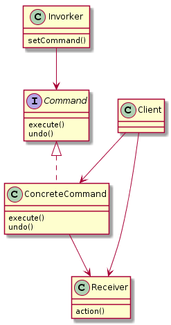
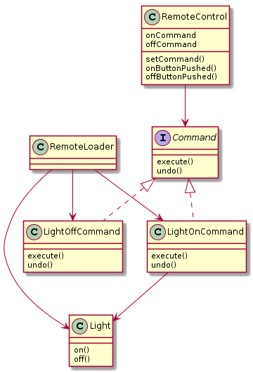

# Command

## Commandパターン
リクエストをオブジェクトとしてカプセル化し、  
その結果、他のオブジェクトを異なるリクエスト・キューまたはログリクストで  
パラメータ化でき、アンドゥ可能な操作もサポートする。  
  

## 定義的なクラス図

- Command  
  ...全てのコマンド(オブジェクト)のためのインターフェースを定義します。

- ConcreteCommand  
  ...action()とReceiverの結びつきを定義する。  
  Invorkerがexecute()することでConcreteCommandへリクエストを行い、  
  ConcreteCommandがReceiverの１つ以上のactionを呼び出すことでそれを実行する。  

- Invorker  
  ...コマンド(オブジェクト)を保持し、  
  ある時点でのコマンドのexecute()を呼び出すことで  
  コマンド(オブジェクト)にリクエストを実行するよう依頼する。  
  様々なコマンド(オブジェクト)をパラメタ化して保持できるが、
  具体的なコマンド(オブジェクト)の内容は知らない。(Commandインターフェースを実装している何かだと知っている程度)

- Receiver
- Client

## 具体的な例

- Command
- LightOnCommand / LightOffCommand
- RemoteControl
- Light
- RemoteLoader
