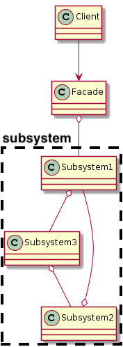
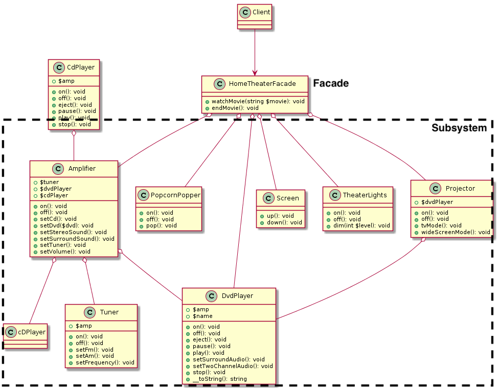

# Facade

## Facadeパターン
サブシステムの一連のインターフェースに対する、  
統合されたインターフェースを提供する。  
ファサードは、サブシステムをより使いやすくする  
高水準インターフェースを定義する。  

## 定義的なクラス図


- Facade  
  ...Subsystemをより使いやすく統合したインターフェース
  
- Client  
  ...ファサードのおかげで作業が簡単になった幸福なクライアント
  
- Subsystem  
  ...より複雑なサブシステムたち 

## 具体的な例


- HomeTheaterFacade.php[Facade]  
Subsystemの中で、ホームシアターに必要な  
一連のオペレーションを統一したインターフェース  
  
- main.php[Client]  
ホームシアターを使うクライアント
  
- Subsystem/[Subsystem]  
アンプやDVDプレーヤ、ポップコーンマシーン、  
スクリーン、ライトなどの機材のクラス  

## 動かしたら

```
$ php src/Facade/main.php 
▶︎ 映画を見る準備をします！
ボップコーンマシーンをONにします
ボップコーンを作ります
シアターライトを10にします
スクリーンを下げてセットします
プロジェクターをONにします
プロジェクターをワイドスクリーンモードにします
アンプをONにします
アンプにDVDプレーヤをセットします
アンプにサラウンドサウンドをセットします
アンプにボリュームを5にします
DVDプレーヤーをONにします
DVD「アナ雪」をスタートします
▶︎ 映画を終了します。
ボップコーンマシーンをOFFにします
シアターライトをONにします
スクリーンを上げてしまいます
プロジェクターをOFFにします
アンプをOFFにします
DVDをストップします
DVDを取り除きます
DVDプレーヤーをOFFにします
```