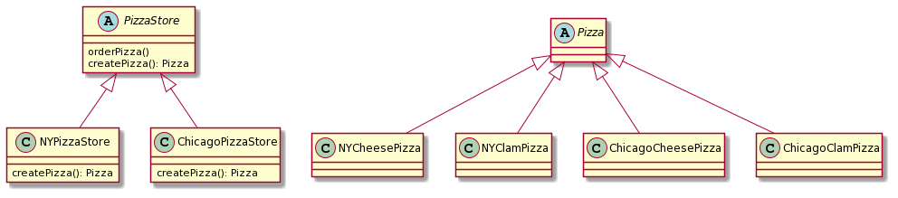

# FactoryMethod

- PizzaStore(スーパークラス)  
Pizzaオブジェクトを作成する具体的な方法は全く知りませんが、  
createPizzaメソッドを使えばPizzaオブジェクトを作成できることを知っています。  
→orderPizzaメソッド内でcreatePizzaを使用して実装している。  

- NYPizzaStore(PizzaStoreのサブクラス)  
具象Pizza(NYスタイル)オブジェクトを作成する  

- ChicagoPizzaStore(PizzaStoreのサブクラス)  
具象Pizza(Chicagoスタイル)オブジェクトを作成する  

- Pizza   
抽象Pizzaクラス  

    └ NYCheesePizza　具象Pizza  
    └ NYClamPizza 具象Pizza   
    └ ChicagoCheesePizza　具象Pizza  
    └ ChicagoClamPizza 具象Pizza 

  

