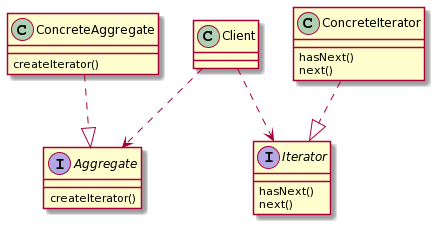
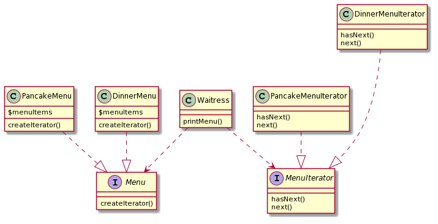

# Iterator

## Iteratorパターン
内部表現を公開することなく、Aggregate(集合体)Objectの要素に順次アクセスする(反復処理)方法を提供する。

反復処理をAggregate(集合体)ではなくIteratorに任せることで、Aggregate(集合体)の実装が簡潔になり本来の責務を遂行できるようになる。
 
反復処理をカプセル化することで、Aggregate(集合体)の本来の処理と分離することができる。

## 定義的なクラス図

- Iterator  
すべてのIteratorが実装する必要があるコレクション要素の反復処理を提供する。
（PHPでは、デフォルトでIteratorインターフェースがあるが今回は独自に作成した。）

- ConcreteIterator  
具体的な反復処理を実装する。反復処理の現在位置を管理する責務がある。

- Aggregate  
Aggregateインターフェースがあると、クライアントを実際のオブジェクトコレクションの実装から分離できる。  
→具象クラスへの依存がなくなる。

- ConcreteAggregate  
コレクション用のイテレータ（ConcreteIterator）を返すメソッドを実装する。

- Client

## 具体的な例

- MenuIterator[Iterator]  
反復処理に対するインターフェースを定義する。

- PancakeMenuIterator, DinnerMenuIterator[ConcreteIterator]  

- Menu[Aggregate]  
反復処理以外のメニュー項目リストに関する処理を全うできる。

- PancakeMenu, DinnerMenu[ConcreteAggregate]  
PancakeMenuIterator, DinnerMenuIteratorを作成する責務がある。

- Waitress[Client]  
具体的なDinnerMenuやDinnerMenuIteratorは知る必要がなく、MenuとMenuIteratorインターフェースだけを知っていれば良い。  
→具象クラスへの依存がない。
