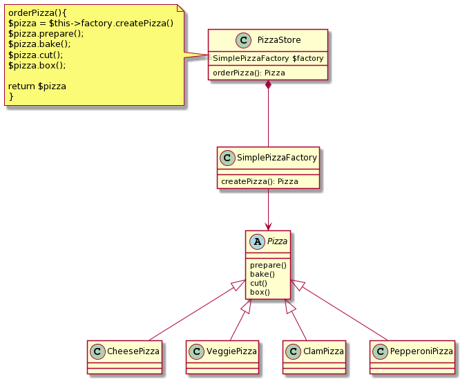

# SimpleFactory

- PizzaStore(SimplePizzaFactoryのクライアント)  
SimplePizzaFactoryを介して、ピザインスタンスを取得する。

- SimplePizzaFactory  
ピザを作成するだけのファクトリクラス
具象Pizzaを参照するアプリケーション内の唯一の部分

- Pizza   
抽象Pizzaクラス

    └ CheesePizza　具象Pizza  
    └ ClamPizza 具象Pizza 
    └ PepperoniPizza 具象Pizza 
    └ VeggiePizza 具象Pizza 

  

