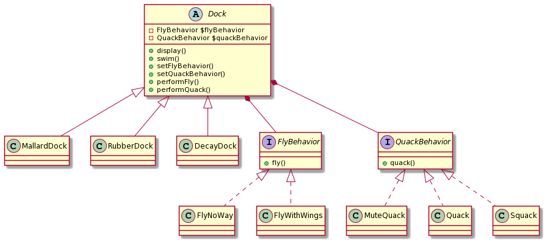

# Strategy

一連のアルゴリズムを定義し、それぞれをカプセル化してそれを交換可能にする。

アルゴリズム(FlyBehavior,QuackBehavior)を使用するクライアント(Dock)とは独立して、アルゴリズムを変更できる

それぞれのDockは
- FlyBehavior
- QuackBehavior

を持つ =『HAS-A』の関係

(setBehavior,setQuackBehaviorでセッターインジェクションしてる)

→ composition ...継承ではなくcomposeして振る舞いを取得している
