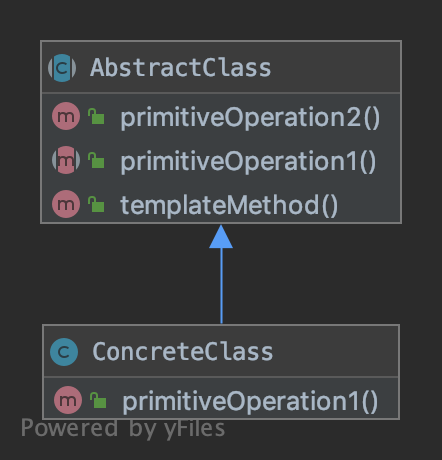
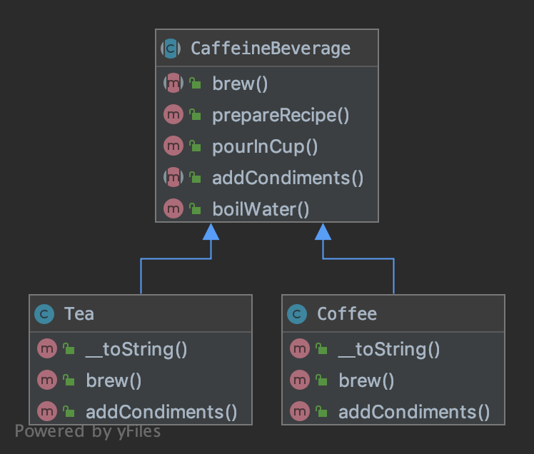

# TemplateMethod

メソッドにおけるアルゴリズムの骨組みを定義し、  
いくつかの手順をサブクラスに先送りする。  

- AbstractClass
templateMethod   
...アルゴリズムのテンプートとなるメソッドを定義する。(関数：templateMethod)  
  
- ConcreteClass  
関数templateMethodで使われるメソッドでサブクラスに先送られたメソッドに関して実装する。  

## Concrete Example
- CaffeineBeverage [AbstractClass]  
...アルゴリズムのテンプートとなるメソッドを定義する。(関数：prepareRecipe)  
関数prepareRecipe内で、boilWater,brew,pourInCup,addCondimentsを使ってる。  
boilWater,pourInCupは共通なのでここで実装する。  
brew,addCondimentsはCoffeeはサブクラスに実装を見送る。  

- Coffee [ConcreteClass]  
brew,addCondimentsはCoffeeで実装する。  
  
- Tea [ConcreteClass]  
brew,addCondimentsはTeaで実装する。  

